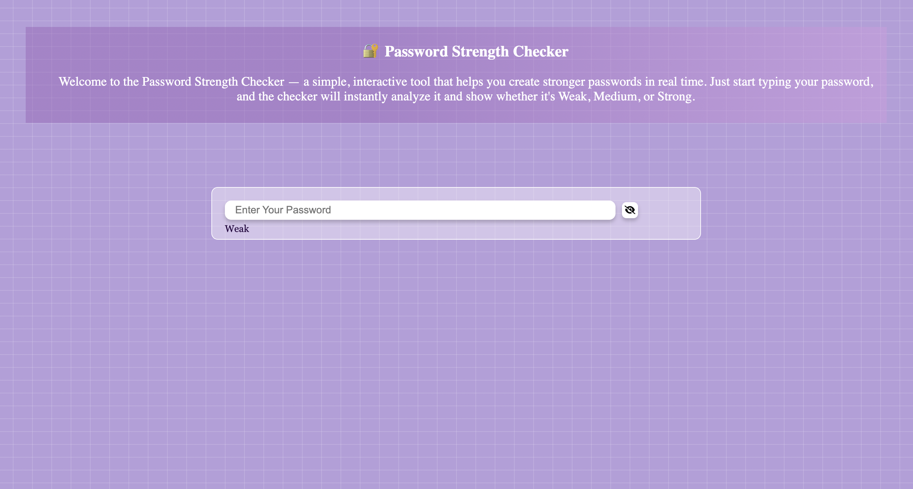
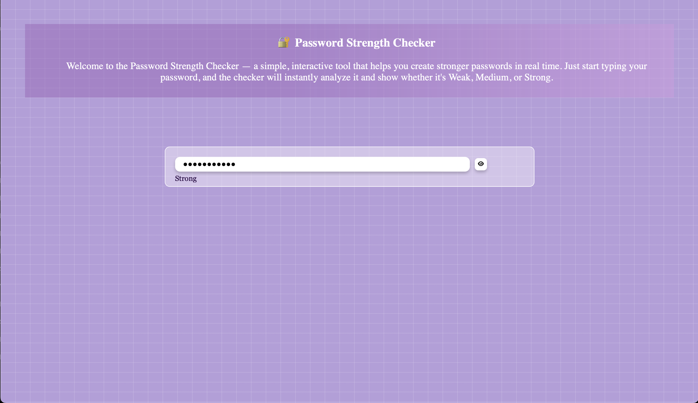
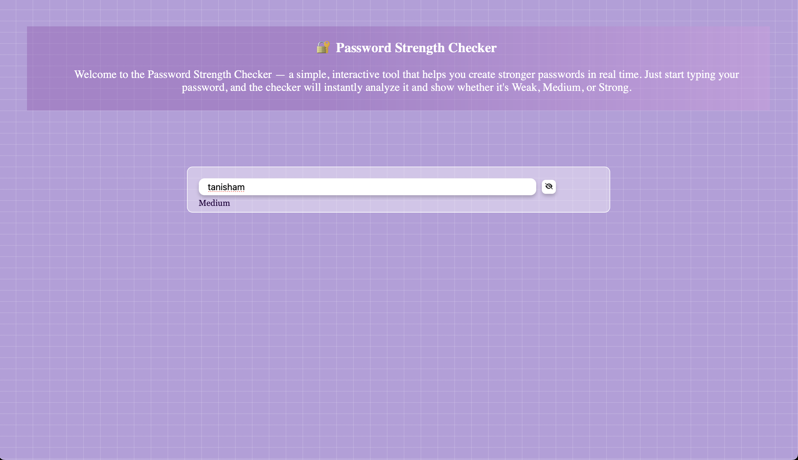

# 🔐 Password Strength Checker

The **Password Strength Checker** is a simple, interactive web tool that helps users create secure passwords by providing real-time feedback on password strength. As you type your password, the checker instantly analyzes it and displays whether it's **Weak**, **Medium**, or **Strong**.

---

## 🚀 Features

- ✅ Real-time password strength evaluation
- 👁️ Show/hide password toggle using eye icon
- 💬 Instant visual feedback (Weak / Medium / Strong)
- 🎨 Modern and clean user interface
- 🔁 Animated hover and input effects

## 🛠️ Built With

- HTML
- CSS
- JavaScript
- [Font Awesome](https://fontawesome.com/) for icons

## 📌 How It Works

- **Weak**: Less than 5 characters  
- **Medium**: 5 to 9 characters  
- **Strong**: 10 or more characters  
- Eye icon toggles between showing and hiding the password input

## 📸 Preview

  
  
  

